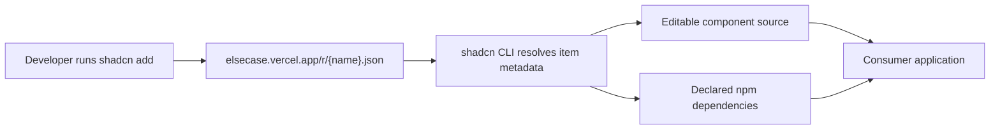
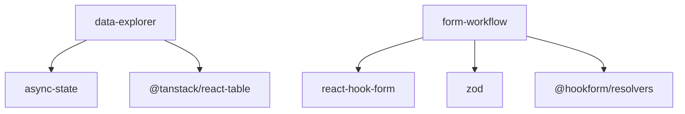

# Elsecase architecture

Elsecase is one Next.js application and one shadcn-compatible source registry.
It deliberately avoids a runtime package: consumers copy the component source
and own it inside their application.



## Repository boundaries

```text
app/                     Documentation site and public registry host
components/docs/         Deterministic interactive examples
components/site/         Site navigation and public product surface
registry/                Canonical installable source and behavior tests
stories/                 Component-state inspection in Storybook
tests/accessibility/     axe coverage for states and themes
tests/e2e/               Browser, responsive, URL, focus, and install-link checks
public/r/                Generated shadcn registry JSON
registry.json            Registry manifest and dependency graph
```

## Registry dependency graph



`ResponsiveDataExplorer` reuses `AsyncState` for request conditions.
`FormWorkflow` is independent and supports Zod object schemas whose named paths
can be registered by React Hook Form.

## State ownership

- Registry components own orchestration and accessible default surfaces.
- Applications own requests, caches, domain data, persistence, and routing.
- Controlled props expose state slices when a server-driven application needs
  to coordinate them.
- Examples are deterministic and database-free so every documented failure path
  can be reproduced without an account or remote service.

## Delivery path

1. `shadcn build` validates `registry.json` and emits `public/r/*.json`.
2. Next.js serves documentation and the generated registry from the same origin.
3. GitHub Actions runs formatting, linting, type checking, unit/accessibility
   tests, registry validation, Storybook, the production build, and Playwright.
4. Vercel deploys the main branch; public installation checks use that deployment.
